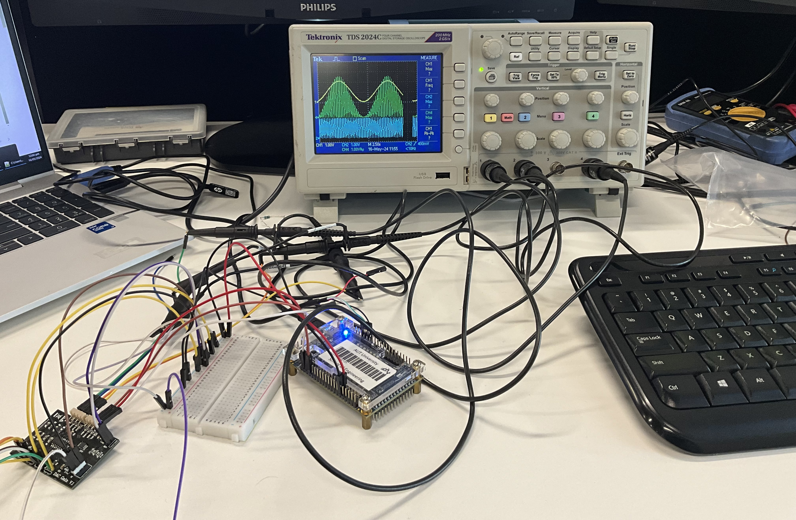

# FPGA-MCP4728-DAC-Controller

## Description
This project involves configuring the MCP4728A0T-E/UN microchip using an FPGA. The MCP4728 is a 12-bit digital-to-analog converter (DAC) with 4 channels, configurable via the I2C communication protocol. The project also utilizes UART to communicate between the FPGA and a Python script that generates and sends voltage values to the FPGA.

## Features
- Configures MCP4728A0T-E/UN DAC using an FPGA
- Supports 4 channels with 12-bit resolution
- I2C communication protocol for DAC configuration
- UART communication for sending voltage values from a Python script to the FPGA

## Installation
To get started with the project, follow these steps:

### Prerequisites
- Python 3.x
- FPGA development environment (Quartus DE0-Nano)
- MCP4728A0T-E/UN microchip
- UART-to-USB converter (if necessary)

Program the FPGA by DAC_controller.vhd and test the board using dac_test Python file.

